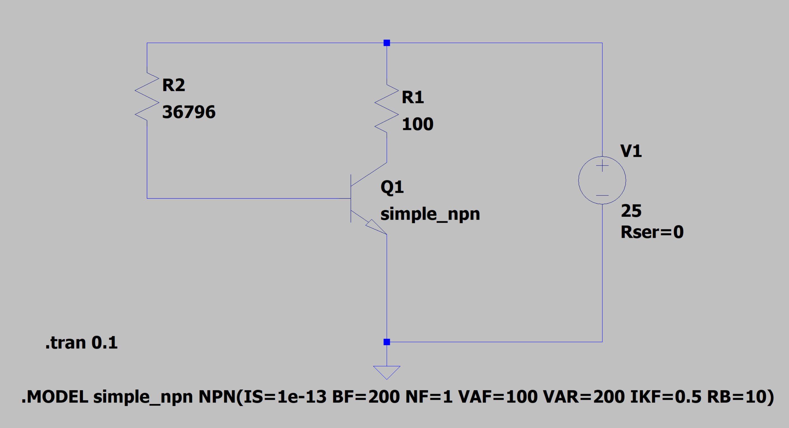
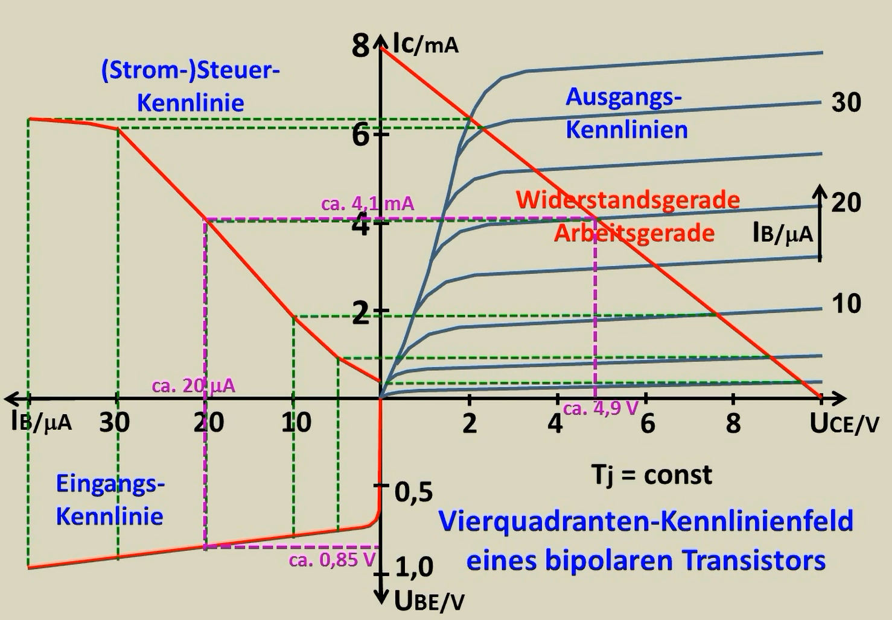

**Vorlesungsmanuskript**

**Halbleiter-Elektronik**

**Bipolare Transistoren: Erweitertes SPICE-Modell**

+------------------------------------+---------------------------------------------------------------------------+
| **Themen:**                        | **Begleitprogramm:**                                                      |
|                                    |                                                                           |
| ▸ Gummel-Poon-Modell               | Erweitere_Spice_Parameter_1.py                                            |
|                                    |                                                                           |
| ▸ Early-Effekt (Kollektor & Basis) | **Umgebung:**                                                             |
|                                    |                                                                           |
| ▸ Hochstrom-Effekt (Webster)       | Python 3.x, NumPy, Matplotlib                                             |
|                                    |                                                                           |
| ▸ Interner Basiswiderstand         | **Voraussetzungen:**                                                      |
|                                    |                                                                           |
| ▸ Newton-Raphson-Verfahren         | Grundkenntnisse Halbleiterphysik, Schaltungstechnik, Differentialrechnung |
|                                    |                                                                           |
| ▸ Bisektionsverfahren              |                                                                           |
|                                    |                                                                           |
| ▸ Arbeitspunkt-Berechnung          |                                                                           |
+====================================+===========================================================================+
+------------------------------------+---------------------------------------------------------------------------+

{width=95%}

**Prof. Dr.-Ing. Ralph Wystup M.Sc.**

# 1 Motivation und Lernziele

Das ideale Shockley-Modell des bipolaren Transistors (BJT) beschreibt das Bauelement mit nur wenigen Parametern und ist hervorragend geeignet, um das grundlegende Verhalten zu verstehen. Für die Simulation realer Schaltungen -- insbesondere mit SPICE-Simulatoren wie LTspice oder ngspice -- werden jedoch deutlich differenziertere Modelle benötigt. Das bekannteste davon ist das **Gummel-Poon-Modell**, das dem Standard-SPICE-Transistormodell zugrunde liegt.

In dieser Vorlesung analysieren wir Schritt für Schritt ein Python-Programm, das die wichtigsten Erweiterungen des Standardmodells implementiert und den Transistor-Arbeitspunkt numerisch berechnet.

+-----------+---------------------------------------------------------------------------------------------------+
| **Ziele** | **Nach dieser Einheit können Sie:**                                                               |
|           |                                                                                                   |
|           | -   den Einfluss der Early-Spannung auf Kollektor- und Basisstrom quantitativ beschreiben,        |
|           |                                                                                                   |
|           | -   den Webster-Effekt (beta-Abfall bei Hochstrom) modellieren und berechnen,                     |
|           |                                                                                                   |
|           | -   den internen Basiswiderstand als Korrektur der effektiven Basis-Emitter-Spannung einbeziehen, |
|           |                                                                                                   |
|           | -   ein nichtlineares Gleichungssystem mit dem Newton-Raphson-Verfahren lösen,                    |
|           |                                                                                                   |
|           | -   einen Arbeitspunkt via Bisektionsverfahren automatisch einstellen,                            |
|           |                                                                                                   |
|           | -   alle genannten Effekte im Python-Code identifizieren und nachvollziehen.                      |
+===========+===================================================================================================+
+-----------+---------------------------------------------------------------------------------------------------+

# 2 Physikalische Grundlagen des bipolaren Transistors

## 2.1 Das ideale Dioden-Exponentialgesetz

Der Kollektorstrom eines npn-Transistors im Normalbetrieb (Vorwärtsbetrieb, aktiver Bereich) folgt aus der Shockley-Gleichung. Der Sättigungsstrom *I*ₛ (SPICE: IS) beschreibt den Diffusionsstrom bei vollständiger Verarmung der Basis:

$$I_{C} = I_{S} \cdot \exp\left( \frac{V_{BE}}{n\text{ }V_{T}} \right)$$

mit

$$V_{T} = \frac{k_{B}\text{ }T}{q} \approx 25.86\text{ mV}\text{  }\text{bei~}T = 300\text{ K}$$

und

$$n = \text{Idealfaktor~(SPICE:~NF)},n \approx 1.0$$

Die **Temperaturspannung** Vᴛ ist gegeben durch:

$$V_{T} = \frac{k_{B}\text{ }T}{q}$$

$$= \frac{1.381 \times 10^{- 23}\text{ J/K\:\,} \cdot \text{\:\,}300\text{ K}}{1.602 \times 10^{- 19}\text{ C}}$$

$$= 25.86\text{ mV}$$

## 2.2 Stromverstärkung und Basisstrom

Im idealen Modell ist die DC-Stromverstärkung *β*ₛ (SPICE: BF) konstant. Der Basisstrom ergibt sich damit zu:

$$I_{B} = \frac{I_{C}}{\beta_{F}} = \frac{I_{S}}{\beta_{F}} \cdot \exp\left( \frac{V_{BE}}{n\text{ }V_{T}} \right)$$

In der Praxis ist *β* jedoch strom-, temperatur- und spannungsabhängig. Das Gummel-Poon-Modell und die im Programm implementierten Erweiterungen bilden diese Abhängigkeiten quantitativ ab.

# 3 Erweiterte SPICE-Parameter -- Herleitung und Bedeutung

## 3.1 Early-Effekt am Kollektor (VAF)

### 3.1.1 Physikalische Ursache

Bei zunehmendem *V*ᴄᴇ weitet sich die Raumladungszone an der Kollektor-Basis-Sperrschicht aus. Dadurch wird die effektive Basisbreite *W*ᴃ schmaler (Basisbreitenmodulation). Da die Steigung des Trägerprofils in der Basis zunimmt, steigt der Kollektorstrom an. Dieser Effekt heißt **Early-Effekt** (nach James Early, 1952).

+------------+----------------------------------------------------------------------------------------------------------------------+
| **Modell** | Die modifizierte Kollektor-Kennlinie lautet:                                                                         |
|            |                                                                                                                      |
|            | $$I_{C} = I_{S} \cdot \exp\left( \frac{V_{BE}}{n\text{ }V_{T}} \right) \cdot \left( 1+\frac{V_{CE}}{V_{A}} \right)$$ |
|            |                                                                                                                      |
|            | SPICE-Parameter: VAF (Forward Early Voltage, Kollektor-Early-Spannung, typisch 50--200 V)                            |
+============+======================================================================================================================+
+------------+----------------------------------------------------------------------------------------------------------------------+

### 3.1.2 Geometrische Interpretation

Extrapoliert man die Ausgangskennlinien Iᴄ(Vᴄᴇ) im aktiven Bereich nach links bis zur Vᴄᴇ-Achse, schneiden sie sich (näherungsweise) alle im Punkt *V*ᴄᴇ = −Vₐ. Dieser Schnittpunkt definiert die Early-Spannung Vₐ (SPICE: VAF). Je größer Vₐ, desto flacher die Kennlinien und desto geringer der Early-Effekt.

### 3.1.3 Ausgangsleitwert

Der differentielle Ausgangsleitwert (Kleinsignal) ergibt sich durch Ableiten:

Ausgehend von der Early‑Gleichung:

$$I_{C} = I_{S} \cdot \exp\left( \frac{V_{BE}}{n\text{ }V_{T}} \right) \cdot \left( 1+\frac{V_{CE}}{V_{A}} \right)$$

leitet sich der **Ausgangsleitwert** ab:

$$g_{CE} = \frac{\partial I_{C}}{\partial V_{CE}} = I_{S} \cdot \exp\left( \frac{V_{BE}}{n\text{ }V_{T}} \right) \cdot \frac{1}{V_{A}}$$

Da der Ausdruck vor $1/V_{A}$ genau der Arbeitspunkt‑Kollektorstrom ist, gilt:

$$g_{CE} \approx \frac{I_{C}}{V_{A}}$$

Exakt ist dabei

$$g_{CE} = \frac{I_{C}}{V_{A} + V_{CE}},$$

denn $I_{C}$ enthält bereits den Faktor $(1+V_{CE}/V_{A})$. Der relative Abstand zwischen Näherung und exaktem Ausdruck ist genau $V_{CE}/V_{A}$: bei $V_{A}=146\text{ V}$ und $V_{CE}=5\text{ V}$ sind das 3,4 %, bei $V_{A}=95\text{ V}$ und $V_{CE}=12{,}5\text{ V}$ schon 13,2 %.

## 3.2 Basis-Early-Effekt (VAR / VAB)

Analog zum Kollektor-Early-Effekt existiert ein Early-Effekt auf den Basisstrom. Durch die Basisbreitenmodulation verändert sich nicht nur Iᴄ, sondern auch Iᴃ. SPICE modelliert dies mit der **Basis-Early-Spannung** (SPICE: VAR, auch Vₐᴃ oder Vₐᴃ genannt):

$$I_{B} = \left( \frac{I_{S}}{\beta_{\text{eff}}} \right) \cdot \exp\left( \frac{V_{BE,\text{eff}}}{n\text{ }V_{T}} \right) \cdot \left( 1+\frac{V_{CE}}{V_{AB}} \right)$$

**SPICE: VAR** (Reverse Early Voltage, Einfluss auf den Basisstrom) Typischer Wert: $V_{AB} = 100\ldots 500\text{ V}$

Für Vₐᴃ → ∞ verschwindet dieser Effekt (idealer Basisstrom). In der Praxis ist Vₐᴃ meist größer als Vₐ, d. h. der Basis-Early-Effekt ist schwächer als der Kollektor-Early-Effekt.

## 3.3 Hochstrom-Effekt: Beta-Abfall (IKF)

### 

### {width=95%}

### 

### 3.3.1 Ursache

Bei sehr hohen Kollektorströmen (Iᴄ \> IᴊF, dem \"Knickstrom\") beginnt die injizierte Trägerkonzentration in der Basis mit der Dotierungskonzentration vergleichbar zu werden. Es tritt **Hochinjektion** auf. Zwei Effekte reduzieren *β*:

-   Webster-Effekt: Bei Hochinjektion sinkt das Verhältnis Iᴄ/Iᴃ, da der Rekombinationsstrom in der Basis überproportional zunimmt.

-   Kirk-Effekt: Bei sehr hohen Stromdichten verlagert sich die Kollektorraumladungszone in die epitaxiale Schicht (Basisausweitung).

### 3.3.2 Modell nach Webster / Gummel-Poon

Das Gummel-Poon-Modell beschreibt den Hochstrom-Abfall von *β* durch:

$$\beta_{\text{eff}}(I_{C}) = \frac{\beta_{F}}{\sqrt{\text{ }1 + \frac{I_{C}}{I_{KF}}\text{ }}}$$

$$I_{KF}:\text{Knickstrom~(SPICE:~IKF,~typisch~}10\text{ mA}\ldots 1\text{ A)}$$

$$I_{C} \ll I_{KF}:\beta_{\text{eff}} \approx \beta_{F}\text{(kein~Abfall)}$$

$$I_{C} \gg I_{KF}:\beta_{\text{eff}} \rightarrow 0\text{(vollst}\ddot{\text{a}}\text{ndiger}\text{~Abfall)}$$

### 3.3.3 Herleitung der Formel

Ausgangspunkt ist die allgemeine Ladungssteuerungsgleichung des Gummel-Poon-Modells. Die normierte Basisladung Qᴃ/Qᴃ₀ lautet näherungsweise:

$$q_{B} = \frac{Q_{B}}{Q_{B0}} \approx \frac{1}{2} + \sqrt{\left( \frac{1}{2} \right)^{2} + \frac{I_{C}}{I_{KF}}}$$

$$\text{F}\ddot{\text{u}}\text{r~}I_{C} \ll I_{KF}:q_{B} \approx 1\text{(normale~Basisladung)}$$

$$\text{F}\ddot{\text{u}}\text{r~}I_{C} \gg I_{KF}:q_{B} \approx \sqrt{\frac{I_{C}}{I_{KF}}}\text{(erh}\ddot{\text{o}}\text{hte}\text{~Ladung)}$$

$$\text{Da~}I_{C} \propto \frac{1}{q_{B}},\text{~gilt:}$$

$$I_{C,\text{eff}} = \frac{I_{C,\text{ideal}}}{q_{B}}$$

$$\Rightarrow \beta_{\text{eff}} = \frac{\beta_{F}}{q_{B}} \approx \frac{\beta_{F}}{\sqrt{\text{ }1 + \frac{I_{C}}{I_{KF}}\text{ }}}$$

## 3.4 Interner Basiswiderstand (RBM)

### 3.4.1 Physikalische Ursache

Die Basiszone hat eine endliche laterale Ausdehnung. Der Basisstrom muss durch den Bahnwiderstand des Basisgebietes fließen. Dieser **interne Basiswiderstand** Rᴃ,int (SPICE: RBM) bewirkt einen ohmschen Spannungsabfall, der die effektiv wirkende Basis-Emitter-Spannung reduziert:

$$V_{BE,\text{eff}} = V_{BE} - I_{B} \cdot R_{B,\text{int}}$$

$$\left. \ R_{B,\text{int}}:\ \text{Interner~Basiswiderstand~(SPICE:~RBM,~typisch~}1\ldots 50\text{ }\Omega \right)$$

$$I_{B}:\ \text{Basisstrom~am~Arbeitspunkt}$$

$$V_{BE}:\ddot{\text{ }\text{A}}\text{ußere}\text{~Basis-Emitter-Spannung~(Klemmenspannung)}$$

Da Iᴃ von Vᴃᴇ,eff und Vᴃᴇ,eff von Iᴃ abhängt, entsteht eine implizite Rückkopplung. Im Programm wird diese Kopplung bei jeder Auswertung von F(Vᴃᴇ, Vᴄᴇ) konsistent berücksichtigt.

### 3.4.2 Ableitung der effektiven Spannung nach V_BE

Für die Jacobi-Matrix wird die Ableitung $\frac{dV_{BE,\text{eff}}}{dV_{BE}}$ benötigt. Mit Iᴃ = (Vᴃᴃ − Vᴃᴇ)/Rᴃ:

$$V_{BE,\text{eff}} = V_{BE} - I_{B} \cdot R_{B,\text{int}}$$

$$= V_{BE} - \left( \frac{V_{BB} - V_{BE}}{R_{B}} \right) \cdot R_{B,\text{int}}$$

$$\frac{dV_{BE,\text{eff}}}{dV_{BE}} = 1 - \left( 0-\frac{1}{R_{B}} \right) \cdot R_{B,\text{int}}$$

$$= 1 + \frac{R_{B,\text{int}}}{R_{B}}$$

$$R_{B}:\text{Externer~Basisvorwiderstand~(Schaltung)}$$

$$R_{B,\text{int}}:\text{Interner~Basisbahnwiderstand~(Bauelement-Parameter)}$$

# 4 SPICE-Parameterübersicht

Die folgende Tabelle fasst alle im Programm verwendeten Parameter zusammen:

  ---------------------------------------------------------------------------------------------------
  **SPICE-Parameter**   **Symbol**   **Wert**    **Bedeutung**
  --------------------- ------------ ----------- ----------------------------------------------------
  IS                    Iₛ           1×10⁻¹³ A   Sättigungsstrom (Diffusionsstrom bei Verarmung)

  BF                    βₛ           200         Kleinsignal-Stromverstärkung (Forward Beta)

  NF                    n            1.0         Idealfaktor des Emitterübergangs

  VAF                   Vₐ           100 V       Kollektor-Early-Spannung (Ausgangskennl. Steigung)

  VAR                   Vₐᴃ          200 V       Basis-Early-Spannung (Einfluss auf Iᴃ)

  IKF                   IᴊF          0.5 A       Knickstrom: Beginn des β-Abfalls bei Hochstrom

  RBM                   Rᴃ,int       10 Ω        Interner (minimaler) Basisbahnwiderstand
  ---------------------------------------------------------------------------------------------------

# 5 Die untersuchte Schaltung

## 5.1 Fixed-Bias-Schaltung

Das Programm analysiert eine **Fixed-Bias-Schaltung** (einfache Basisvorspannung) mit npn-Transistor:

  -----------------------------------------------------------------------
  V_CC = 25 V (Versorgungsspannung)
  -----------------------------------------------------------------------
  V_BB = V_CC (Basisspannung = V_CC, fixed bias)

  R_C = 100 Ohm (Kollektorwiderstand)

  R_B = variabel (wird durch Bisektionsverfahren optimiert)
  -----------------------------------------------------------------------

## 5.2 Maschengleichungen

Aus den zwei unabhängigen Maschen ergeben sich die Gleichungen:

**Basiskreis**

$$V_{BB} = I_{B} \cdot R_{B} + V_{BE}$$

$$\Rightarrow I_{B} = \frac{V_{BB} - V_{BE}}{R_{B}}$$

**Kollektorkreis**

$$V_{CC} = I_{C} \cdot R_{C} + V_{CE}$$

$$\Rightarrow I_{C} = \frac{V_{CC} - V_{CE}}{R_{C}}\text{(Lastgerade)}$$

# 6 Das nichtlineare Gleichungssystem F(V_BE, V_CE) = 0

## 6.1 Aufstellung

Gesucht sind die zwei Unbekannten Vᴃᴇ und Vᴄᴇ, die gleichzeitig die Transistorkennlinie und die Lastgeraden-Gleichungen erfüllen. Man stellt zwei Residuen Gleichungen auf:

### Gleichung 1 -- Basiskreis (mit Basis-Early-Effekt)

### 

$$f_{1}(V_{BE},V_{CE}) = I_{B} - \left( \frac{I_{S}}{\beta_{\text{eff}}} \right) \cdot \exp\left( \frac{V_{BE,\text{eff}}}{n\text{ }V_{T}} \right) \cdot \left( 1+\frac{V_{CE}}{V_{AB}} \right) = 0$$

$$I_{B} = \frac{V_{BB} - V_{BE}}{R_{B}}\text{ }\text{[aus~Basiskreismasche]}$$

$$V_{BE,\text{eff}} = V_{BE} - I_{B} \cdot R_{B,\text{int}}\text{   }\text{[Spannungsabfall~int.~Basiswiderstand]}$$

$$\beta_{\text{eff}} = \frac{\beta_{F}}{\sqrt{\text{ }1 + \frac{I_{C}}{I_{KF}}\text{ }}}\text{   }\text{[Webster-Formel]}$$

### Gleichung 2 -- Kollektorkreis (mit Kollektor-Early-Effekt)

### 

$$f_{2}(V_{BE},V_{CE}) = I_{C} - I_{S} \cdot \exp\left( \frac{V_{BE,\text{eff}}}{n\text{ }V_{T}} \right) \cdot \left( 1+\frac{V_{CE}}{V_{A}} \right) = 0$$

$$I_{C} = \frac{V_{CC} - V_{CE}}{R_{C}}\text{   }\text{[Lastgeradengleichung]}$$

## 6.2 Kopplung der Gleichungen

Die beiden Gleichungen sind über Vᴃᴇ,eff (enthält Iᴃ, der von Vᴃᴇ abhängt) und über βᴇḟḟ (enthält Iᴄ, der von Vᴄᴇ abhängt) miteinander verkoppelt. Ein geschlossener analytischer Ausdruck existiert nicht -- numerische Lösung ist notwendig.

# 7 Newton-Raphson-Verfahren

## 7.1 Grundprinzip

Das Newton-Raphson-Verfahren ist das Standard-Verfahren für nichtlineare Gleichungssysteme in SPICE-Simulatoren. Für ein System F(x) = 0 mit x ∈ ℝⁿ lautet die Iterationsvorschrift:

$$x_{k + 1} = x_{k} - J(x_{k})^{- 1}\text{ }F(x_{k})$$

$$x_{k}:\text{aktueller~Iterationsvektor~}\lbrack\text{ }V_{BE},\text{ }V_{CE}\text{ }\rbrack^{T}$$

$$F\left( x_{k} \right):\ \ \text{Residuenvektor~}\lbrack\text{ }f_{1}(x_{k}),\text{ }f_{2}(x_{k})\text{ }\rbrack^{T}$$

$$J\left( x_{k} \right):\ \text{Jacobi-Matrix~(2×2),~}\frac{dF}{dx}\text{~ausgewertet~an~}x_{k}$$

Praktisch wird nicht die inverse Jacobi-Matrix berechnet, sondern das lineare Gleichungssystem:

**J(xₖ) · Δx = −F(xₖ)** gelöst (im Programm: numpy.linalg.solve):

$$\Delta x = solve\left( J(x_{k}),\text{ } - F(x_{k}) \right)$$

$$x_{k + 1} = x_{k} + \Delta x$$

$$\text{Abbruchkriterium:} \mid F(x_{k}) \mid < \text{tol}\text{  }(\text{hier:~tol} = 10^{- 10})$$

## 7.2 Jacobi-Matrix

Die Jacobi-Matrix J enthält alle partiellen Ableitungen von F = \[f₁, f₂\]ᵀ nach den Unbekannten \[Vᴃᴇ, Vᴄᴇ\]ᵀ:

$$J = \begin{bmatrix}
\frac{\partial f_{1}}{\partial V_{BE}} & \frac{\partial f_{1}}{\partial V_{CE}} \\
\frac{\partial f_{2}}{\partial V_{BE}} & \frac{\partial f_{2}}{\partial V_{CE}}
\end{bmatrix}$$

### Herleitung der Jacobi-Elemente

**Element J₁₁ = ∂f₁/∂Vᴃᴇ:**

Vollständig ausgeschriebene Form von $f_{1}$und $\partial f_{1}/\partial V_{BE}$

Funktion $f_{1}$

$$f_{1} = I_{B} - \left( \frac{I_{S}}{b} \right) \cdot exp\left( \frac{V_{BE,\text{eff}}}{n\text{ }V_{T}} \right) \cdot \left( 1+\frac{V_{CE}}{V_{AB}} \right)$$

Ableitung $\partial f_{1}/\partial V_{BE}$

$$\frac{\partial f_{1}}{\partial V_{BE}} = - \frac{1}{R_{B}}\text{\:\,} - \text{\:\,}\left( \frac{I_{S}}{b} \right) \cdot exp\left( \frac{V_{BE,\text{eff}}}{n\text{ }V_{T}} \right) \cdot \frac{dV_{BE,\text{eff}}}{dV_{BE}} \cdot \frac{1}{n\text{ }V_{T}} \cdot \left( 1+\frac{V_{CE}}{V_{AB}} \right)$$

**Element J₁₂ = ∂f₁/∂Vᴄᴇ:**

Ausgehend von:

$$f_{1} = I_{B} - \left( \frac{I_{S}}{b} \right) \cdot \exp\left( \frac{V_{BE,\text{eff}}}{n\text{ }V_{T}} \right) \cdot \left( 1+\frac{V_{CE}}{V_{AB}} \right)$$

Die einzige Abhängigkeit von $V_{CE}$steckt im Faktor:

$$\left( 1+\frac{V_{CE}}{V_{AB}} \right)$$

Daher:

$$\frac{\partial f_{1}}{\partial V_{CE}} = - \left( \frac{I_{S}}{b} \right) \cdot \exp\left( \frac{V_{BE,\text{eff}}}{n\text{ }V_{T}} \right) \cdot \frac{1}{V_{AB}}$$

**Element J₂₁ = ∂f₂/∂Vᴃᴇ:**

Ausgehend von:

$$f_{2} = I_{C} - I_{S} \cdot \text{ }\exp\left( \frac{V_{BE,\text{eff}}}{n\text{ }V_{T}} \right) \cdot \left( 1+\frac{V_{CE}}{V_{A}} \right)$$

Die Abhängigkeit von $V_{BE}$steckt ausschließlich im Exponenten über

$$V_{BE,\text{eff}} = V_{BE} - I_{B} \cdot R_{B,\text{int}}$$

Daher:

$$\frac{\partial f_{2}}{\partial V_{BE}} = - I_{S} \cdot \text{ }\exp\left( \frac{V_{BE,\text{eff}}}{n\text{ }V_{T}} \right) \cdot \frac{dV_{BE,\text{eff}}}{dV_{BE}} \cdot \frac{1}{n\text{ }V_{T}} \cdot \left( 1+\frac{V_{CE}}{V_{A}} \right)$$

Mit:

$$\frac{dV_{BE,\text{eff}}}{dV_{BE}} = 1 + \frac{R_{B,\text{int}}}{R_{B}}$$

**Element J₂₂ = ∂f₂/∂Vᴄᴇ:**

$$\frac{\partial f_{2}}{\partial V_{CE}} = - \frac{1}{R_{C}}\text{\:\,} - \text{\:\,}I_{S}\text{ }\exp\left( \frac{V_{BE,\text{eff}}}{n\text{ }V_{T}} \right) \cdot \frac{1}{V_{A}}$$

$$\text{mit}\text{      }\frac{dI_{C}}{dV_{CE}} = - \frac{1}{R_{C}}\text{             }\text{(Lastgerade)}$$

## 7.3 Konvergenzverhalten

Das Newton-Raphson-Verfahren konvergiert bei guten Startwerten **quadratisch**: der Fehler wird bei jedem Schritt etwa quadriert. Für den BJT-Arbeitspunkt ist der Startwert \[Vᴃᴇ, Vᴄᴇ\] = \[0.65 V, Vᴄᴄ/2\] meist ausreichend, da der Arbeitspunkt stets in der Nähe dieser Werte liegt.

# 8 Bisektionsverfahren zur Arbeitspunkt-Einstellung

## 8.1 Aufgabenstellung

Ziel: Finde Rᴃ so, dass der Transistor im **optimalen Arbeitspunkt** arbeitet. Als optimaler Arbeitspunkt wird *Vᴄᴇ = Vᴄᴄ/2* gewählt (maximaler symmetrischer Aussteuerungsbereich bei Kleinsignal-Verstärkern).

## 8.2 Monotonieeigenschaft

Die Abhängigkeit Vᴄᴇ(Rᴃ) ist monoton: Eine **Erhöhung von Rᴃ** reduziert Iᴃ, damit Iᴄ, damit den Spannungsabfall über Rᴄ, und Vᴄᴇ steigt. Diese Monotonie ist die Voraussetzung für das Bisektionsverfahren.

+-----------------------------------------------------------------------+
| R_B ↑ =\>                                                             |
|                                                                       |
| I_B ↓ =\>                                                             |
|                                                                       |
| I_C ↓ =\>                                                             |
|                                                                       |
| V_RC = I_C\*R_C ↓ =\>                                                 |
|                                                                       |
| V_CE = V_CC - V_RC ↑                                                  |
+=======================================================================+
+-----------------------------------------------------------------------+

## 8.3 Algorithmus

Der Bisektionsalgorithmus arbeitet wie folgt:

  -----------------------------------------------------------------------
  1\. Initialisierung: R_B_min = 10 kOhm, R_B_max = 500 kOhm
  -----------------------------------------------------------------------
  2\. Mittelpunkt: R_B_try = (R_B_min + R_B_max) / 2

  3\. Newton-Raphson lösen -\> V_CE(R_B_try)

  4\. Abbruchbedingung: \|V_CE - V_CC/2\| \<= tol_rel \* V_CC/2

  -\> fertig

  5\. Intervall halbieren:

  V_CE \< V_CC/2 =\> R_B_min = R_B_try (R_B muss grösser werden)

  V_CE \> V_CC/2 =\> R_B_max = R_B_try (R_B muss kleiner werden)

  6\. Weiter mit Schritt 2 (max. 30 Iterationen)
  -----------------------------------------------------------------------

Die Toleranz ist mit tol_rel = 5 % definiert, d. h. Vᴄᴇ muss im Bereich \[0.475 · Vᴄᴄ, 0.525 · Vᴄᴄ\] liegen. Das Verfahren konvergiert garantiert (da monoton), aber nur linear (log₂ der Fehler nimmt pro Schritt um 1 ab).

# 9 Analyse des Python-Programms

## 9.1 Modulstruktur

Das Programm ist in folgende Abschnitte gegliedert:

  ----------------------------------------------------------------------------------------
  **Programmteil**                  **Funktion**
  --------------------------------- ------------------------------------------------------
  Konstanten / Parameter            Physikalische und SPICE-Parameter, Schaltungswerte

  beta_eff(I_C)                     Webster-Formel: stromabhängige Verstärkung

  V_BE_eff(V_BE, I_B)               Effektive Basis-Emitter-Spannung nach R_B,int-Abfall

  F(vars)                           Residuenvektor f1, f2 des nichtlinearen GLS

  J(vars)                           Jacobi-Matrix (analytisch berechnet)

  newton_method(guess)              Newton-Raphson-Iteration (max. 100 Schritte)

  finde_R_B_fuer_ap(V_CC)           Bisektionsverfahren: Suche nach optimalem R_B

  plot_kennlinie(R_B, V_BE, V_CE)   Darstellung Kennlinie, Lastgerade, Arbeitspunkt

  Hauptprogramm (\_\_main\_\_)      Ausgabe Parameter, Aufruf Bisektion, Ergebnisausgabe
  ----------------------------------------------------------------------------------------

## 9.2 Kernfunktion F(vars) -- Residuenvektor

Diese Funktion berechnet die beiden Gleichungsfehler bei gegebenen \[Vᴃᴇ, Vᴄᴇ\]:

  -----------------------------------------------------------------------
  def F(vars):
  -----------------------------------------------------------------------
  V_BE, V_CE = vars

  I_B = (V_BB - V_BE) / R_B \# Basisstrom aus Maschengleichung

  I_C = (V_CC - V_CE) / R_C \# Kollektorstrom aus Lastgerade

  V_eff = V_BE_eff(V_BE, I_B) \# Spannungsabfall an R_B,int

  exp_term = np.exp(V_eff/(n\*V_T)) \# Exponentialterm

  b_eff = beta_eff(I_C) \# Webster: beta-Abfall

  eq1 = I_B - (I_S/b_eff)\*exp_term\*(1 + V_CE/V_AB) \# Basisgleichung

  eq2 = I_C - I_S\*exp_term\*(1 + V_CE/V_A) \# Kollektorgleichung

  return np.array(\[eq1, eq2\])
  -----------------------------------------------------------------------

## 9.3 Kenngrößen am Arbeitspunkt

Nach Konvergenz des Algorithmus werden folgende Kenngrößen ausgegeben:

  -----------------------------------------------------------------------
  R_B : Optimierter Basisvorwiderstand (Ergebnis der Bisektion)
  -----------------------------------------------------------------------
  V_BE : Klemmen-Basis-Emitter-Spannung

  V_BE,eff : Effektive Basis-Emitter-Spannung (nach R_B,int-Korrektur)

  V_CE : Kollektor-Emitter-Spannung am Arbeitspunkt

  I_B : Basisstrom am Arbeitspunkt

  I_C : Kollektorstrom am Arbeitspunkt

  beta_F : Nominale Stromverstärkung

  beta_eff : Tatsächliche Stromverstärkung (unter Einfluss von IKF)
  -----------------------------------------------------------------------

# 10 Numerisches Beispiel und Ergebnisinterpretation

## 10.1 Erwartete Ausgabe

Für die gegebenen Parameter ergibt sich näherungsweise:

  ---------------------------------------------------------------------------------------------------------------
  **SPICE-Parameter**   **Symbol**            **Wert**                   **Bedeutung**
  --------------------- --------------------- -------------------------- ----------------------------------------
  VAF = 100 V           Ausgangswiederstand   r_CE ≈ V_A/I_C             Endliche Steigung in Ausgangskennlinie

  VAR = 200 V           Basis-Early           I_B leicht V_CE-abhängig   Geringer als Kollektor-Early-Effekt

  IKF = 0.5 A           Webster-Knickstrom    β_eff ≈ β_F                I_C \<\< 0.5 A, kaum Beta-Abfall

  RBM = 10 Ω            Basis-R-Abfall        ΔV_BE,eff = I_B\*R_B,int   Korrekturen im mV-Bereich
  ---------------------------------------------------------------------------------------------------------------

## 10.2 Arbeitspunktlage und Lastgerade

Die Lastgerade verbindet die Punkte (Vᴄᴇ = 0, Iᴄ = Vᴄᴄ/Rᴄ = 250 mA) und (Vᴄᴇ = Vᴄᴄ = 25 V, Iᴄ = 0). Der optimale Arbeitspunkt liegt bei Vᴄᴇ = 12.5 V, Iᴄ = 125 mA. Dies entspricht der Mitte der Lastgeraden und ermöglicht den maximalen symmetrischen Aussteuerungsbereich.

# 11 Vergleich: Ideales Modell vs. erweitertes Modell

  ---------------------------------------------------------------------------------
  **Eigenschaft**     **Ideales Modell**        **Erweitertes Modell (Programm)**
  ------------------- ------------------------- -----------------------------------
  Early-Effekt I_C    keiner (I_C konstant)     I_C\*(1 + V_CE/V_A) \[VAF\]

  Early-Effekt I_B    keiner                    I_B\*(1 + V_CE/V_AB) \[VAR\]

  beta-Abfall         beta = const.             beta_eff(I_C) \[IKF\]

  Basiswiderstand     keiner                    V_BE,eff = V_BE-I_B\*RBM

  Arbeitspunkt        analytisch berechenbar    Newton-Raphson (iterativ)

  Genauigkeit         gut für Orientierung      SPICE-Niveau
  ---------------------------------------------------------------------------------

# 13 Zusammenfassung

+------------------+-------------------------------------------------------------------------------------------------------------------------------------------------------+
| **Kernaussagen** | -   Das Gummel-Poon-Modell ergänzt das ideale BJT-Modell um Early-Effekte (VAF, VAR), Hochstrom-beta-Abfall (IKF) und internen Basiswiderstand (RBM). |
|                  |                                                                                                                                                       |
|                  | -   Alle Erweiterungen führen zu einem nichtlinearen Gleichungssystem, das analytisch nicht lösbar ist.                                               |
|                  |                                                                                                                                                       |
|                  | -   Das Newton-Raphson-Verfahren konvergiert quadratisch und löst das System in wenigen Iterationen.                                                  |
|                  |                                                                                                                                                       |
|                  | -   Das Bisektionsverfahren ist langsamer (lineare Konvergenz), aber garantiert konvergent und ideal für die Optimierung eines Parameters (R_B).      |
|                  |                                                                                                                                                       |
|                  | -   Der optimale Arbeitspunkt bei V_CE = V_CC/2 maximiert den Aussteuerungsbereich.                                                                   |
|                  |                                                                                                                                                       |
|                  | -   Der interne Basiswiderstand RBM ist besonders bei Hochfrequenzanwendungen und hohen Strömen relevant.                                             |
+==================+=======================================================================================================================================================+
+------------------+-------------------------------------------------------------------------------------------------------------------------------------------------------+

# Literaturhinweise

Weiterführende Literatur zur Vertiefung:

-   Sedra/Smith: Microelectronic Circuits -- Grundlagenwerk, BJT-Modellierung in Kapitel 5/6

-   Razavi: Design of Analog CMOS Integrated Circuits -- moderne Sichtweise auf BJT-Parameter

-   Gummel/Poon (1970): An integral charge control model of bipolar transistors, Bell System Technical Journal 49(5) -- Originalpublikation

-   Getreu (1978): Modeling the Bipolar Transistor -- umfassende Darstellung der SPICE-BJT-Modelle

-   LTspice Dokumentation: SPICE BJT model parameters (VAF, VAR, IKF, RBM, \...) -- Referenz für alle Parameterdefinitionen
