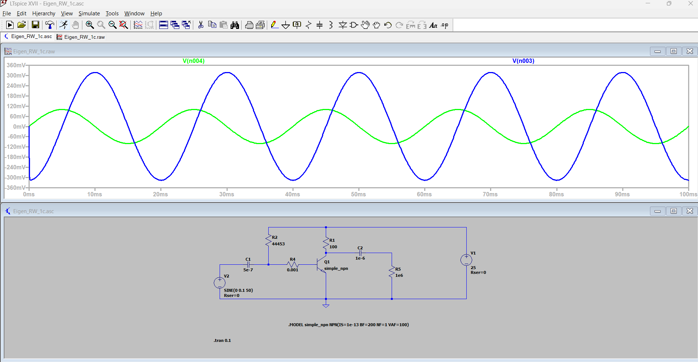
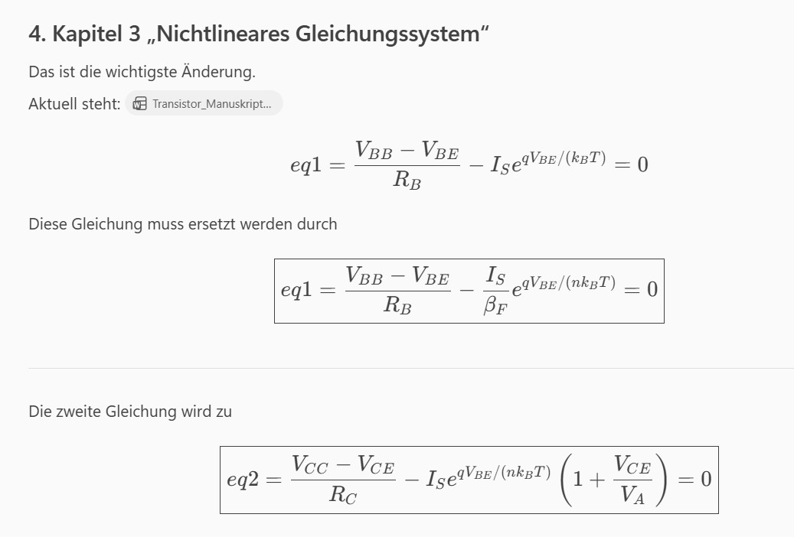
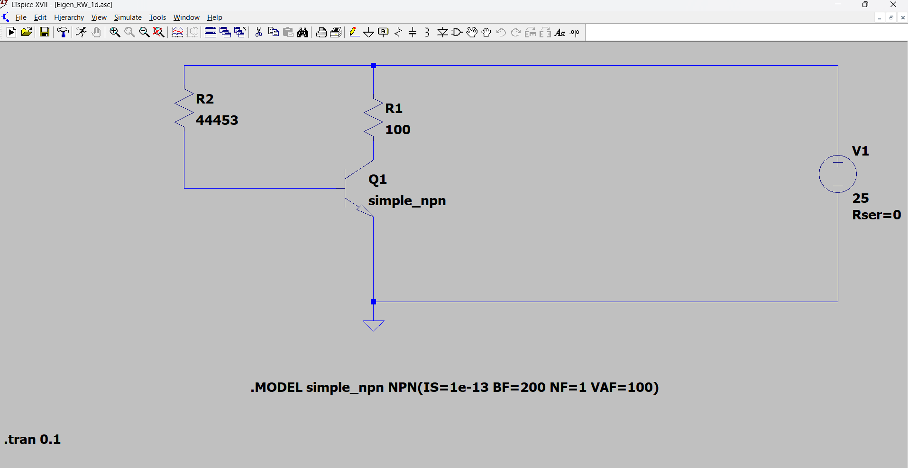

Für ein **einfaches statisches BJT-Modell** würde ich nicht mit allen Datenblatt-Kennlinien anfangen, sondern gezielt nur die Kennfelder einlesen, aus denen sich die wesentlichen Modellparameter identifizieren lassen.

**Minimaler Datensatz**

**1. Ausgangskennfeld**

$$I_{C} = f(V_{CE})$$

für verschiedene feste Basisströme

$$I_{B} = \text{const}.$$

Das sind die klassischen Transistorkennlinien:

I_C

│ IB=80µA

│ /

│ /

│ / IB=60µA

│ /

│ / IB=40µA

└────────── V_CE

Daraus kann man bestimmen:

-   Early-Spannung $V_{A}$

-   Ausgangsleitwert

-   Ausgangswiderstand $r_{o}$

-   β-Verlauf

**2. Gummel-Plot**

$$I_{C}(V_{BE})$$

und

$$I_{B}(V_{BE})$$

bei festem

$$V_{CE}$$

(z.B. 5 V oder 10 V).

Daraus erhält man:

-   $I_{S}$

-   $\beta_{F}$

-   Idealfaktor $n$

**Welche Parameter lassen sich bestimmen?**

**Sättigungsstrom** $\mathbf{I}_{\mathbf{S}}$

Aus

$$I_{C} = I_{S}e^{V_{BE}/(nV_{T})}$$

folgt

$$\ln(I_{C}) = \ln(I_{S}) + \frac{V_{BE}}{nV_{T}}.$$

Im Gummel-Plot:

-   Gerade fitten

-   auf $V_{BE} = 0$extrapolieren

Ergebnis:

$$I_{S}$$

**Idealfaktor** $\mathbf{n}$

Steigung der Gummel-Kurve:

$$m = \frac{d\ln(I_{C})}{dV_{BE}} = \frac{1}{nV_{T}}$$

also

$$n = \frac{1}{mV_{T}}.$$

Typisch:

$$1.0 < n < 1.2.$$

**Stromverstärkung** $\mathbf{\beta}_{\mathbf{F}}$

Aus dem Gummel-Plot:

$$\beta_{F} = \frac{I_{C}}{I_{B}}.$$

Einfach im aktiven Bereich mitteln.

Typisch:

$$50\ldots 300.$$

**Early-Spannung** $\mathbf{V}_{\mathbf{A}}$

Aus den Ausgangskennlinien.

Für jede Kennlinie:

$$I_{C} = I_{C0}\left( 1+\frac{V_{CE}}{V_{A}} \right).$$

Lineare Extrapolation.

Alle Geraden schneiden sich ungefähr bei

$$V_{CE} = - V_{A}.$$

Beispiel:

/

/

/

/

\-\-\--/\-\-\-\-\-\-\-\--

-100V

ergibt

$$V_{A} \approx 100V.$$

**Daraus erhältst du bereits dein momentanes Modell**

$${I_{C} = I_{S}e^{\frac{qV_{BE}}{nk_{B}T}}\left( 1+\frac{V_{CE}}{V_{A}} \right)
}{I_{B} = \frac{1}{\beta_{F}}I_{C}.}$$

Mit lediglich

-   $I_{S}$

-   $n$

-   $\beta_{F}$

-   $V_{A}$

hast du schon ein erstaunlich gutes statisches Modell.

**Falls du etwas weiter gehen möchtest**

Zusätzlich interessant:

**Eingangskennlinie**

$$I_{B} = f(V_{BE})$$

für verschiedene $V_{CE}$.

Damit könntest du prüfen, ob

$$I_{B}$$

einen eigenen Early-Effekt zeigt.

Dann käme man zu einem erweiterten Modell:

$$I_{B} = \frac{I_{S}}{\beta_{F}}e^{V_{BE}/(nV_{T})}\left( 1+\frac{V_{CE}}{V_{AB}} \right).$$

**Meine Empfehlung für dein Manuskript**

Für einen Bachelor-Kurs bzw. eine Vorlesung „Numerische Methoden in der Elektronik“ würde ich genau diese vier Parameter extrahieren:

$$\boxed{I_{S},\text{\:\,}n,\text{\:\,}\beta_{F},\text{\:\,}V_{A}}$$

und als benötigte Messdaten nur

1.  Gummel-Plot

2.  Ausgangskennfeld $I_{C}(V_{CE})$

verwenden.

Damit ist das Modell noch übersichtlich, aber bereits deutlich realistischer als die klassische $\beta = \text{const.}$-Näherung.

Für dein aktuelles Modell brauchst du in LTspice gar kein kompliziertes Gummel-Poon-Modell. Ein sehr einfaches und überraschend gut passendes Modell wäre:

$$I\_ C = = = = I\_ S\exp\left( \frac{V\_ BE}{nV\_ T} \right)\left( 1+\frac{V\_ CE}{V\_ A} \right)$$

mit

$$I\_ B = \frac{I\_ C}{\beta\_ F}.$$

Das entspricht exakt deinem Python-Modell.

**Variante 1: Einfaches LTspice-BJT-Modell**

LTspice verwendet intern bereits das Gummel-Poon-Modell.

Daher genügt oft:

.model NPN_SIMPLE NPN(

\+ IS=1e-13

\+ BF=100

\+ VAF=100

\+ NF=1

)

Bedeutung:

IS   = Sättigungsstrom

BF   = Vorwärtsverstärkung βF

VAF  = Early-Spannung

NF   = Emissionskoeffizient n

Das entspricht nahezu direkt deinen Parametern:

I_S = 1e-13

beta_F = 100

V_A = 100

n = 1

**Schaltung**

VCC   VCC 0 25

RC    VCC C 100

RB    VCC B 209k

Q1    C B 0 NPN_SIMPLE

**Arbeitspunktanalyse**

.op

liefert dann ungefähr:

VBE ≈ 0.65 V

VCE ≈ 12.5 V

IC  ≈ 125 mA

IB  ≈ 1.25 mA

für deinen aktuellen Fall

VCC = 25 V

RC  = 100 Ω

**Welche Kennlinien würde ich vermessen?**

**1. Gummel-Plot**

Simulation:

.dc VBE 0.4 0.9 1m

Auswertung:

Ic(VBE)

Ib(VBE)

Daraus:

-   IS

-   BF

-   NF

**2. Ausgangskennlinien**

Simulation:

.step param IB 10u 200u 20u

.dc VCE 0 25 0.1

Daraus:

-   VAF

-   Ausgangswiderstand

-   β-Verlauf

**Parameterextraktion**

Mit deinen Vorlesungszielen würde ich exakt diese vier Größen bestimmen:

IS

BF

NF

VAF

also

  -----------------------------------------------------------------------
  **Parameter**           **Bedeutung**
  ----------------------- -----------------------------------------------
  IS                      Sättigungsstrom

  BF                      Gleichstromverstärkung

  NF                      Idealfaktor

  VAF                     Early-Spannung
  -----------------------------------------------------------------------

**Noch schöner für die Vorlesung**

Dann ergibt sich ein direkter Zusammenhang zwischen Simulation und Python:

Python:

I_B = (I_S/beta_F) \* exp(\...)

I_C = I_S \* exp(\...) \* (1 + V_CE/V_A)

LTspice:

.model NPN_SIMPLE NPN(

\+ IS=1e-13

\+ BF=200

\+ VAF=100

\+ NF=1

)

Die Studierenden sehen dann sehr schön:

Die vier Parameter $I\_ S$, $BF$, $NF$und $VAF$reichen bereits aus, um aus gemessenen Kennlinien ein einfaches statisches Transistormodell abzuleiten und anschließend numerisch mit Newton-Raphson den Arbeitspunkt zu berechnen.

Das ist didaktisch sauber und stellt den direkten Bezug zwischen Kennlinienmessung, Parameteridentifikation und numerischer Simulation her.

{width=95%}

*(eingebettete Datei — siehe Verzeichnis der Programme)*

*(eingebettete Datei — siehe Verzeichnis der Programme)*

{width=95%}

*(eingebettete Datei — siehe Verzeichnis der Programme)*

Das Ergebnis sieht sehr vernünftig aus. Aus dem Plot kann man einige Dinge direkt ablesen:

**Verstärkung**

Eingang (grün):

$$\widehat{u}\_ e \approx 100,\text{mV}$$

Ausgang (blau):

$$\widehat{u}\_ a \approx 160,\text{mV}$$

also

$$A\_ v \approx \frac{160}{100} \approx 1.6.$$

Die Stufe verstärkt also.

**Phasenlage**

Der Ausgang ist invertiert:

-   Eingang positiv → Ausgang negativ

-   Eingang negativ → Ausgang positiv

also ungefähr

$$\Delta\varphi \approx 180^{\circ}$$

genau wie bei einer Emitterschaltung erwartet.

**Arbeitspunkt**

Der Ausgang ist über

C2 = 1 µF

\`\`

ausgekoppelt.

Deshalb siehst du im Plot nur den Wechselanteil.

Wenn du den tatsächlichen Arbeitspunkt prüfen möchtest, solltest du zusätzlich ausführen:

.op

und kontrollieren:

V(B)

V(C)

V(B,E)

V(C,E)

Ic(Q1)

Ib(Q1)

\`

**Was mich freut**

Die gewählten Modellparameter

IS=5e-16

BF=110

NF=1

VAF=100

verhalten sich genau so, wie dein Python-Modell vorhersagt:

$${I\_ C = = = = I\_ S\exp!\left( \frac{V\_ BE}{nV\_ T} \right)\left( 1+\frac{V\_ CE}{V\_ A} \right)
}{I\_ B = = = = \frac{I\_ C}{BF}}$$

mit

$$BF \approx 110,VAF \approx 100V.$$

**Der nächste interessante Schritt**

Ich würde jetzt tatsächlich die vier Modellparameter aus LTspice \"zurückgewinnen\".

**Gummel-Plot**

Simulation:

.dc VBE 0.4 0.9 1m

Dann plotten:

Ic(Q1)

Ib(Q1)

(logarithmische Achse)

Daraus:

-   IS

-   BF

-   NF

bestimmen.

**Ausgangskennlinien**

Beispielsweise:

.step param IB 10u 100u 10u

.dc VCE 0 20 0.1

Daraus:

-   VAF

-   Early-Effekt

-   Ausgangswiderstand

bestimmen.

**Didaktisch besonders schön**

Du hast jetzt praktisch die Kette

Messung / Kennlinien

       ↓

Parameterextraktion

       ↓

LTspice-Modell

IS

BF

NF

VAF

       ↓

Python-Modell

IS

beta_F

n

V_A

       ↓

Newton-Raphson

       ↓

Arbeitspunkt

und genau daraus lässt sich ein sehr schönes Kapitel zur modellgestützten Transistoranalyse entwickeln. Das ist deutlich näher an der Praxis als die übliche \"VBE = 0,7 V und β = 100\"-Näherung.

{width=95%}

*(eingebettete Datei — siehe Verzeichnis der Programme)*

Ja. Wenn man die von mir vorgeschlagenen Erweiterungen

-   Early-Effekt

-   Basis-Early-Effekt

-   β-Abfall bei hohen Strömen (IKF)

-   interner Basiswiderstand $R_{B,int}$

alle zusammenfasst, erhält man folgendes kompaktes Gleichungssystem.

**Hilfsgrößen**

Temperaturspannung

$$V_{T} = \frac{k_{B}T}{q}$$

Äußerer Basisstrom

$$I_{B} = \frac{V_{BB} - V_{BE}}{R_{B}}$$

Kollektorstrom aus der Lastgeraden

$$I_{C} = \frac{V_{CC} - V_{CE}}{R_{C}}$$

stromabhängige Verstärkung

$$\beta_{eff} = \frac{\beta_{F}}{1 + \frac{I_{C}}{I_{KF}}}$$

effektive Basis-Emitter-Spannung

$$V_{BE,eff} = V_{BE} - I_{B}R_{B,int}$$

Exponentialterm

$$E = \exp\text{ ⁣}\left( \frac{V_{BE,eff}}{nV_{T}} \right)$$

**Gleichung 1**

Basiskreis

$$\boxed{\frac{V_{BB} - V_{BE}}{R_{B}} - \frac{I_{S}}{\beta_{eff}}E\left( 1+\frac{V_{CE}}{V_{AB}} \right) = 0}$$

mit

$$V_{AB}$$

als Basis-Early-Spannung.

**Gleichung 2**

Kollektorkreis

$$\boxed{\frac{V_{CC} - V_{CE}}{R_{C}} - I_{S}E\left( 1+\frac{V_{CE}}{V_{A}} \right) = 0}$$

**Ausgeschrieben**

Damit ergibt sich

$$\boxed{\frac{V_{BB} - V_{BE}}{R_{B}} - \frac{I_{S}}{\frac{\beta_{F}}{1 + \frac{I_{C}}{I_{KF}}}}\text{ }\exp\text{ ⁣}\left( \frac{V_{BE} - R_{B,int}\frac{V_{BB} - V_{BE}}{R_{B}}}{nV_{T}} \right)\left( 1+\frac{V_{CE}}{V_{AB}} \right) = 0}$$

und

$$\boxed{\frac{V_{CC} - V_{CE}}{R_{C}} - I_{S}\exp\text{ ⁣}\left( \frac{V_{BE} - R_{B,int}\frac{V_{BB} - V_{BE}}{R_{B}}}{nV_{T}} \right)\left( 1+\frac{V_{CE}}{V_{A}} \right) = 0}$$

wobei

$$I_{C} = \frac{V_{CC} - V_{CE}}{R_{C}}$$

in die erste Gleichung eingesetzt wird.

**Parameter des Modells**

Damit hätte dein statisches Modell folgende Parameter:

$$I_{S}$$

Sättigungsstrom

$$n$$

Idealfaktor

$$\beta_{F}$$

Stromverstärkung bei kleinen Strömen

$$V_{A}$$

Early-Spannung des Kollektorstroms

$$V_{AB}$$

Early-Spannung des Basisstroms

$$I_{KF}$$

Knickstrom für den β-Abfall

$$R_{B,int}$$

interner Basiswiderstand

**Didaktische Empfehlung**

Für dein Manuskript würde ich allerdings vermutlich bei

$$I_{S},n,\beta_{F},V_{A}$$

stehen bleiben.

Erst danach ein Kapitel

„Erweiterungen des einfachen Modells“

mit

$$I_{KF}$$

und

$$R_{B,int}$$

einführen.

Das ergibt eine sehr schöne Hierarchie:

1.  Shockley

2.  Shockley + β

3.  Shockley + β + Early

4.  Shockley + β + Early + β-Abfall

5.  Shockley + β + Early + β-Abfall + Basiswiderstand

und jede Erweiterung entspricht unmittelbar Parametern, die auch im LTspice-Gummel-Poon-Modell vorkommen.

Ja, im Wesentlichen stimmt das. Die Idee ist dieselbe:

Die ideale Shockley-Gleichung

$$I = I\_ S\left( e^{V/(nV\_ T)}-1 \right)$$

beschreibt nur den pn-Übergang selbst. Reale Bauelemente besitzen zusätzlich ohmsche Widerstände.

Dann ersetzt man

$$V \rightarrow V\_ j + IR\_ S$$

und erhält

$$I = I\_ S\left( e^{\frac{V - IR\_ S}{nV\_ T}}-1 \right)$$

bzw.

$$V = nV\_ T\ln!\left( \frac{I}{I\_ S} \right) + IR\_ S.$$

Das ist exakt dieselbe mathematische Struktur wie bei deinem Modell

$$V\_ BE,eff = = = = = = = = = = = = = = = = = = = = V\_ BE - I\_ BR\_ B.$$

Allerdings wäre ich vorsichtig mit der Aussage:

„Der Serienwiderstand ist der Faktor, der blaue LEDs gut approximiert.“

Er ist **ein wichtiger Faktor**, aber oft nicht der einzige.

Bei blauen InGaN-LEDs beobachtet man häufig:

1.  **Nichtkonstanter Idealfaktor** $n$

2.  **Serienwiderstand** $R\_ S$

3.  **Selbsterwärmung**

4.  **Rekombinationsmechanismen**, die sich mit dem Strom ändern

Deshalb passt eine einzige Shockley-Kurve oft nur über 1--2 Stromdekaden.

Wenn du beispielsweise eine blaue LED misst, sieht die Kennlinie oft so aus:

-   kleine Ströme: nahezu exponentiell

-   mittlere Ströme: sehr gute Shockley-Näherung

-   große Ströme: Spannung steigt stärker als exponentiell erwartet

Dieser letzte Effekt wird tatsächlich sehr gut durch

$$*IR\_ S$$

beschrieben.

Für Lehrzwecke würde ich sogar sagen:

Der Serienwiderstand einer LED spielt dieselbe Rolle wie der interne Basiswiderstand im erweiterten Transistormodell.

Beide beschreiben eine zusätzliche ohmsche Spannung, die bei hohen Strömen die ideale Exponentialkennlinie verlässt.

Deshalb ist dein Ansatz mit

V_eff = V_BE - I_B\*R_B_int

genau dieselbe Art von Korrektur, die man bei LEDs mit einem Serienwiderstand verwendet.

Für Lehrzwecke ist das eine sehr schöne Frage, denn praktisch alle deine Parameter lassen sich direkt aus Kennlinien extrahieren.

**1. IS und NF aus der Eingangskennlinie**

Man misst bei festem $V_{CE}$:

$$I_{C}(V_{BE})$$

Im aktiven Bereich gilt:

$$I_{C} \approx I_{S}\exp\text{ }\text{⁣}\left( \frac{V_{BE}}{N_{F}V_{T}} \right)$$

Logarithmieren:

$$\ln(I_{C}) = \ln(I_{S}) + \frac{V_{BE}}{N_{F}V_{T}}$$

**Vorgehen**

Halblogarithmische Darstellung:

$$\ln(I_{C})\text{gegen}V_{BE}$$

ergibt eine Gerade.

Steigung:

$$m = \frac{1}{N_{F}V_{T}}$$

daraus

$$N_{F} = \frac{1}{mV_{T}}$$

Achsenabschnitt:

$$\ln(I_{S})$$

also

$$I_{S} = e^{\text{Achsenabschnitt}}$$

**2. BF aus den Stromverstärkungskennlinien**

Bei kleinem Kollektorstrom (weit unter IKF)

$$\beta_{F} = \frac{I_{C}}{I_{B}}$$

Einfach messen:

$$\beta_{F} \approx \frac{I_{C}}{I_{B}}$$

im linearen Bereich.

Bei einem Kleinsignaltransistor erhält man typischerweise:

-   BC547: 100\...500

-   2N3904: 100\...300

**3. VAF aus den Ausgangskennlinien**

Du misst

$$I_{C}(V_{CE})$$

für konstantes $I_{B}$.

Ideale Kennlinie:

IC

│ ─────────────

│

└────────────── VCE

Reale Kennlinie:

IC

│ /

│ /

│ /

└──/────────── VCE

Der Schnittpunkt der extrapolierten Geraden liegt bei

$$V_{CE} = - V_{AF}$$

**Beispiel**

Wenn die Verlängerung die Spannungsachse bei

$$- 100V$$

schneidet:

$$V_{AF} = 100V$$

Genau das macht SPICE mit

$$I_{C} = I_{C0}\left( 1+\frac{V_{CE}}{V_{AF}} \right)$$

**4. VAR bzw. dein VAB**

Das ist dasselbe Verfahren, aber für den Basisstrom.

Du misst:

$$I_{B}(V_{CE})$$

bei konstantem $V_{BE}$.

Dann:

$$I_{B} = I_{B0}\left( 1+\frac{V_{CE}}{V_{AR}} \right)$$

Extrapoliert man die Geraden zurück, erhält man:

$$V_{CE} = - V_{AR}$$

In vielen Datenblättern findet man diese Kennlinien allerdings nicht.

Deshalb wird VAR häufig geschätzt oder auf einen plausiblen Wert gesetzt.

**5. IKF aus dem β-Abfall**

Du hast modelliert:

$$\beta_{eff} = \frac{\beta_{F}}{\sqrt{1 + \frac{I_{C}}{I_{KF}}}}$$

Dazu misst man:

$$\beta(I_{C}) = \frac{I_{C}}{I_{B}}$$

über mehrere Dekaden Strom.

Typische Form:

β

│ \_\_\_\_\_

│ /

│\_\_\_\_\_/ \\

│ \\\_\_

└────────────────── IC

IKF liegt ungefähr dort, wo β merklich abzufallen beginnt.

Genauer:

Bei

$$I_{C} = I_{KF}$$

ergibt dein Modell

$$\beta_{eff} = \frac{\beta_{F}}{\sqrt{2}} \approx 0.707\beta_{F}$$

Daher:

**IKF = der Strom, bei dem β auf etwa 70 % seines Maximalwertes gefallen ist.**

**6. RB bzw. RBM**

Diesen Parameter erkennt man an der Krümmung der Eingangskennlinie bei großen Strömen.

Ohne RB:

$$V_{BE} = V_{T}\ln\left( \frac{I_{C}}{I_{S}} \right)$$

Mit RB:

$$V_{BE} = V_{T}\ln\left( \frac{I_{C}}{I_{S}} \right) + I_{B}R_{B}$$

Bei hohen Strömen steigt $V_{BE}$stärker an als erwartet.

**Bestimmung**

Miss

$$V_{BE}(I_{B})$$

und berechne

$$R_{B} = \frac{\Delta V_{BE}}{\Delta I_{B}}$$

im Hochstrombereich.

**Für dein Python-Modell**

Die Parameter lassen sich folgendermaßen aus Messungen extrahieren:

  -----------------------------------------------------------------------
  **Parameter**        **Kennlinie**
  -------------------- --------------------------------------------------
  IS                   $\ln(I_{C})$gegen $V_{BE}$

  NF                   Steigung von $\ln(I_{C})$gegen $V_{BE}$

  BF                   $I_{C}/I_{B}$bei kleinen Strömen

  VAF                  Extrapolation der $I_{C}(V_{CE})$-Kennlinien

  VAR (= dein VAB)     Extrapolation der $I_{B}(V_{CE})$-Kennlinien

  IKF                  β-Abfall auf ca. 70 %

  RBM                  Steigung von $V_{BE}(I_{B})$im Hochstrombereich
  -----------------------------------------------------------------------

Für eine Vorlesung würde ich genau diese sechs Messungen zeigen, weil man damit fast dein gesamtes erweitertes Modell identifizieren kann.
