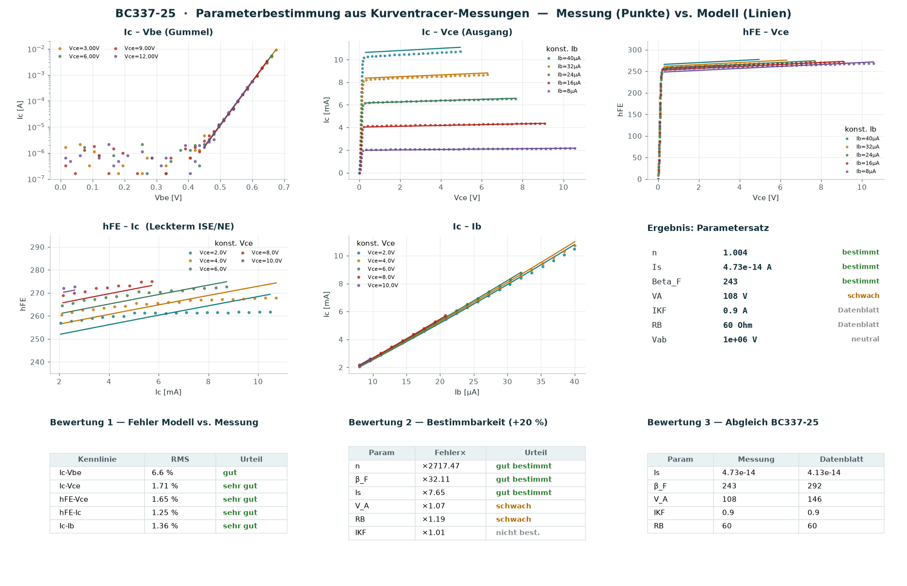

> **Autor:** Prof. Dr.-Ing. Ralph Wystup M.Sc. · **Vorlesungsmanuskript zur Transistortechnik**
>
> **Version 2** — Kapitel 2 verwendet ausschließlich das vereinfachte Modell mit den Klemmenspannungen $V_{BE}, V_{CE}$ (keine $V_{BC}$-Formulierung, kein Leckterm); ergänzt um Kap. 5.7 „Das messungsbasierte Vierquadranten-Kennlinienfeld".

# Vorbemerkung — Ziel und Anspruch dieses Skripts

Dieses Skript verfolgt ein Ziel: **vollständige Transparenz der Methode**. Es zeigt lückenlos,

1. **welches physikalische Modell** dem Bipolartransistor zugrunde liegt (Gummel-Poon),
2. **welche Parameter** (SPICE) darin vorkommen und was sie bedeuten,
3. **wie man diese Parameter aus Messungen bestimmt** — mit jeder Annahme, jeder Näherung und den Grenzen der Bestimmbarkeit,
4. **wie man daraus das Kleinsignalverhalten (h-Parameter)** ableitet — analytisch und grafisch.

Als durchgehendes Rechenbeispiel dient ein realer **NPN-Transistor BC337-25**, dessen Kennlinien mit einem Kurventracer aufgenommen und ausgewertet wurden.

> **Grundannahmen des gesamten Skripts (sofern nicht anders vermerkt):**
> - Temperatur $T = 300\,\text{K}$, damit Thermospannung $V_T = k_B T/q = 25{,}85\,\text{mV}$.
> - NPN-Transistor im **Vorwärts-Aktivbetrieb** ($V_{BE}>0$, $V_{BC}<0$).
> - **Quasistatik** (keine Kapazitäten) für DC- und h-Parameter-Betrachtung.
> - Ein-Dimensionalität, homogene Dotierung je Zone, Niedriginjektion außer wo ausdrücklich Hochinjektion behandelt wird.

---

# 1. Physikalische Grundlagen

## 1.1 Der Transistor als gesteuerte Quelle
Ein NPN-Transistor besteht aus zwei gegeneinander geschalteten pn-Übergängen (Emitter-Basis, Kollektor-Basis) mit einer sehr dünnen Basis. Im Aktivbetrieb ist die **BE-Diode in Fluss**, die **BC-Diode in Sperr**. Über der BE-Diode injizierte Elektronen diffundieren durch die dünne Basis und werden vom Kollektor „abgesaugt".

## 1.2 Ebers-Moll als Ausgangspunkt
Das **Ebers-Moll-Modell** beschreibt beide Dioden mit ihren Transportströmen. Im Vorwärts-Aktivbetrieb dominiert der Vorwärts-Transportstrom

$$
I_{CC} = I_S\left(e^{V_{BE}/V_T}-1\right),
$$

mit dem **Transport-Sättigungsstrom** $I_S$. Der Kollektorstrom ist im Idealfall $I_C \approx I_{CC}$, der Basisstrom $I_B = I_{CC}/\beta_F$. Ebers-Moll erfasst aber **nicht**: Early-Effekt, Hochinjektion, Leckströme, Bahnwiderstände. Genau diese Effekte ergänzt das Gummel-Poon-Modell.

---

# 2. Das verwendete Transistormodell

Diesem Skript liegt ein **vereinfachtes Transistormodell für den Aktivbetrieb** zugrunde — genau die Gleichungen des begleitenden Simulink-Modells. Ausgangspunkt ist die **Early-Gleichung** des Kollektorstroms. Alle Ströme sind Funktionen der **Klemmenspannungen** $V_{BE}$ und $V_{CE}$.

## 2.1 Der Kollektorstrom (Early-Gleichung)

$$
\boxed{\,I_C = I_S\,e^{V_{BE}/(n\,V_T)}\left(1+\frac{V_{CE}}{V_A}\right)\,}
$$

- $I_S$ — Sättigungsstrom, $n$ — Emissionskoeffizient (ideal $\approx 1$), $V_A$ — Early-Spannung.
- Der Exponentialterm beschreibt die in Fluss betriebene BE-Diode; der Faktor $\big(1+V_{CE}/V_A\big)$ die **Basisweitenmodulation (Early-Effekt)** — direkt über die Klemmenspannung $V_{CE}$.

## 2.2 Der Early-Effekt und $V_A$

**(1) Anschauung.** Steigt $V_{CE}$, verbreitert sich die Kollektor-Basis-Sperrschicht in die Basis hinein; die effektive Basisweite sinkt, der Diffusionsgradient steigt, also steigt $I_C$ leicht mit $V_{CE}$ — die Ausgangskennlinien sind nicht exakt waagerecht.

**(2) Messvorschrift.** Extrapoliert man die flachen Äste der Ausgangskennlinien rückwärts, schneiden sie die $V_{CE}$-Achse gemeinsam im Punkt $V_{CE}=-V_A$. Daraus wird $V_A$ bestimmt (Kap. 4).

**(3) Beispiel (BC337-25).** $V_A\approx 146\,\text{V}$ (Datenblatt 145,7 V).

## 2.3 Die effektive Stromverstärkung (Hochinjektion, $I_{KF}$)

**(1) Anschauung.** Bei großem $I_C$ wird die injizierte Ladungsträgerdichte vergleichbar mit der Basisdotierung; die Verstärkung **bricht ein**, $\beta$ fällt bei hohen Strömen ab.

**(2) Mathematik.** Über die normierte Basisladung $q_B$ ergibt sich

$$
\boxed{\,\beta_{\text{eff}} = \frac{\beta_F}{q_B} \approx \frac{\beta_F}{\sqrt{1+I_C/I_{KF}}}\,}
$$

mit der idealen Stromverstärkung $\beta_F$ und dem **Vorwärts-Kniestrom $I_{KF}$**: bei $I_C=I_{KF}$ ist $\beta$ um den Faktor $\sqrt2$ gefallen.

**(3) Beispiel.** BC337-25: $I_{KF}\approx 0{,}9\,\text{A}$ — bei den gemessenen $\le 11\,\text{mA}$ ist $I_C/I_{KF}\lesssim 0{,}01$, der Abfall also **nicht sichtbar** (wichtig für Kap. 4/5).

## 2.4 Der Basisstrom und die innere Basis-Emitter-Spannung

Der innere Basiswiderstand $R_{B,\text{int}}$ reduziert die **innere** Basis-Emitter-Spannung um den Spannungsabfall am Widerstand:

$$
\boxed{\,V_{BE,\text{eff}} = V_{BE} - I_B\,R_{B,\text{int}}\,}
$$

Nur diese innere Spannung treibt den Übergang. Damit lautet der Basisstrom

$$
\boxed{\,I_B = \frac{I_S}{\beta_{\text{eff}}}\,e^{V_{BE,\text{eff}}/(n\,V_T)}\left(1+\frac{V_{CE}}{V_{AB}}\right)\,}
$$

Der Faktor $\big(1+V_{CE}/V_{AB}\big)$ modelliert die (schwache) $V_{CE}$-Abhängigkeit des Basisstroms und ist für die spätere Rückwirkung $h_{12e}$ verantwortlich.

> **Anmerkung (Modellgrenze).** Der reale BC337 zeigt bei kleinem Strom einen leichten $h_{FE}$-Anstieg (Rekombination in der BE-Sperrschicht). Dieses vereinfachte Modell **enthält diesen Effekt bewusst nicht** — er bleibt als kleine, benannte Restabweichung sichtbar (Kap. 4). Vollständige Modelle beschreiben ihn über einen zusätzlichen Leckterm; hier wird er **nicht** verwendet.

## 2.5 Das vollständige Gleichungssystem

$$
\boxed{
\begin{aligned}
I_C &= I_S\,e^{V_{BE}/(n\,V_T)}\left(1+\frac{V_{CE}}{V_A}\right)\\[3pt]
\beta_{\text{eff}} &= \frac{\beta_F}{\sqrt{1+I_C/I_{KF}}}, \qquad V_{BE,\text{eff}} = V_{BE}-I_B\,R_{B,\text{int}}\\[3pt]
I_B &= \frac{I_S}{\beta_{\text{eff}}}\,e^{V_{BE,\text{eff}}/(n\,V_T)}\left(1+\frac{V_{CE}}{V_{AB}}\right)
\end{aligned}}
$$

**Annahmen:** Aktivbetrieb (keine Sättigung, kein Inversbetrieb), $T=300\,\text{K}$, Niedriginjektion außer der über $I_{KF}$ erfassten Hochstromkorrektur.

**Zwei Formulierungen nebeneinander.** Im Exponenten des *Kollektor*stroms steht hier die Klemmenspannung $V_{BE}$; das Vorlesungsmanuskript *BJT-SPICE* setzt an derselben Stelle die innere Spannung $V_{BE,\text{eff}}$ ein, weil der Übergang für beide Ströme dieselbe innere Spannung sieht. Beide Rechnungen sind in sich richtig — $I_S$ nimmt den Unterschied auf —, aber die Parameter der einen Form dürfen nicht in das Programm der anderen eingesetzt werden. Der Unterschied ist der Faktor $\exp\!\big(I_B R_{B,\text{int}}/(n V_T)\big)$: beim BC337-25 mit $I_C=5\,$mA, $V_{CE}=5\,$V ($I_B=18{,}58\,\mu$A, $R_{B,\text{int}}=60\,\Omega$) sind das 1,115 mV und damit **+4,4 %** in $I_C$; beim BC547 im Fixed-Bias-Arbeitspunkt ($I_C=125\,$mA, $I_B=650{,}5\,\mu$A, $R_{B,\text{int}}=15\,\Omega$) sind es 9,758 mV und **+45,3 %**.

## 2.6 Die implizite Gleichung und die algebraische Schleife
$V_{BE,\text{eff}}=V_{BE}-I_B R_{B,\text{int}}$ und $I_B$ hängen **wechselseitig** voneinander ab → im Simulationsfluss entsteht eine **algebraische Schleife**. Sauber löst man sie

- **physikalisch** durch eine kleine Basis-Kapazität $C$ (Knotengleichung $C\,\dot V_{BE,\text{eff}} = (V_{BE}-V_{BE,\text{eff}})/R_{B,\text{int}} - I_B$; im stationären Zustand exakt), oder
- **numerisch** durch einen Fixpunkt-/Newton-Solver.

Ein `z^{-1}`/Delay bricht die Schleife zwar auf, ist wegen der steilen $e$-Funktion aber instabilitätsgefährdet — die Schleife wird am besten **an der Spannung $V_{BE,\text{eff}}$** aufgebrochen, nicht am Strom.

---

# 3. SPICE-Parameter im Überblick

| SPICE | Symbol | Bedeutung | BC337-25 (Ref.) |
|---|---|---|---|
| `IS`  | $I_S$    | Transport-Sättigungsstrom | $4{,}1\cdot10^{-14}$ A |
| `NF`  | $n$    | Vorwärts-Emissionskoeffizient | $1{,}0$ |
| `BF`  | $\beta_F$| ideale Vorwärts-Stromverstärkung | $292$ |
| `VAF` | $V_A$ | Vorwärts-Early-Spannung | $146$ V |
| `IKF` | $I_{KF}$ | Vorwärts-Kniestrom (Hochinjektion) | $0{,}9$ A |
| `ISE` | $I_{SE}$ | B-E-Leck-Sättigungsstrom | $3{,}5\cdot10^{-15}$ A |
| `NE`  | $N_E$    | B-E-Leck-Emissionskoeffizient | $1{,}35$ |
| `RB`  | $R_B$    | Basis-Bahnwiderstand | $60\ \Omega$ |
| `VAR` | $V_{AR}/V_{AB}$ | Rückwärts-Early-Spannung | (Rückwirkung) |

Weitere GP-Parameter (`BR, ISC, NC, IKR, RC, RE`, Kapazitäten `CJE, CJC, TF, TR` …) betreffen Invers-, Sperr- und Dynamikverhalten und werden hier nicht benötigt.

---

# 4. Parameterbestimmung aus Messungen — die Methode

Wir bestimmen die Parameter aus fünf Kennlinienfeldern eines Kurventracers. Jeder Schritt nennt **Messgröße, Formel, Annahme und Grenze**.

## 4.1 $I_S$ und $n$ aus dem Gummel-Plot
**Messung:** $I_C$ über $V_{BE}$ (halblogarithmisch), bei konstantem $V_{CE}$.
**Modell:** $\ln I_C = \ln\!\big[I_S(1+V_{CE}/V_A)\big] + \dfrac{V_{BE}}{n V_T}$.
Die Gerade im halblog. Plot hat **Steigung** $1/(n V_T)$ und **Achsenabschnitt** $\ln I_S'$:

$$
n = \frac{1}{V_T}\cdot\frac{1}{\text{Steigung}}, \qquad
I_S = \frac{e^{\text{Achsenabschnitt}}}{1+V_{CE}/V_A}.
$$

**Annahmen/Grenzen:** Auswertung nur im **rein exponentiellen Ast**. Nach unten begrenzt durch den **Rausch-/Quantisierungsboden** des Tracers (hier $\approx 5\,\mu$A), nach oben durch Hochinjektion/$R_B$. *Wird dieser Bereich nicht sauber gewählt, ergeben sich unphysikalische Werte* (im Beispiel lieferte ein zu weites Fenster zunächst $n\approx 3{,}5$ statt $1{,}0$).
**Beispiel:** $n = 1{,}004$, $I_S = 4{,}8\cdot10^{-14}\,$A.

## 4.2 $V_A$ aus der Ausgangskennlinie
**Messung:** $I_C$ über $V_{CE}$ bei konstantem $I_B$.
**Formel:** flachen Ast linear fitten, $I_C = a + b\,V_{CE}$; der $V_{CE}$-Achsenschnitt liegt bei $-V_A$:

$$
V_A = \frac{a}{b} \quad\Big(=\frac{I_C}{\partial I_C/\partial V_{CE}} - V_{CE}\Big).
$$

**Grenze:** die $V_A$-Werte streuen leicht mit $I_B$; $V_A$ ist nur **schwach** bestimmt. **Beispiel:** $V_A\approx 110\ldots150\,$V.

## 4.3 $\beta_F$ und $I_{KF}$ aus $h_{FE}$
**Messung:** $h_{FE}=I_C/I_B$ über $I_C$ bzw. Steigung von $I_C$-$I_B$.
$\beta_F$ ist das **Plateau/Maximum** von $h_{FE}$; $I_{KF}$ folgt aus dem **Hochstromabfall** $\beta=\beta_F/\sqrt{1+I_C/I_{KF}}$.
**Grenze:** ist der Abfall im Messbereich nicht erreicht, ist $I_{KF}$ **nicht bestimmbar** (nur untere Schranke). **Beispiel:** $\beta_F\approx 250\ldots275$; $I_{KF}$ nicht bestimmbar ($\gg 11\,$mA) → Datenblatt $0{,}9\,$A.

## 4.4 $R_B$ und die Grenze des Modells
- Der reale $h_{FE}$-**Anstieg bei kleinem** $I_C$ (BE-Rekombination) ist im verwendeten Modell **nicht enthalten** (Kap. 2.4) und bleibt eine kleine, benannte Restabweichung.
- $R_B$ zeigt sich erst im **Hochstrom-Knick** des Gummel-Plots; bei kleinen Strömen unsichtbar → **nicht bestimmbar** → Datenblatt.

## 4.5 Globaler Fit und Identifizierbarkeit
Statt Feature-für-Feature kann man **alle** Kennlinien gleichzeitig fitten (hier: **Nelder-Mead**, ableitungsfrei). Kostenfunktion = mittleres quadratisches, datensatzweise gewichtetes Residuum (Gummel im Log-, die übrigen im Relativmaß).

**Der entscheidende Transparenzschritt — Identifizierbarkeit.** Ein Parameter ist nur dann *aus den Daten* bestimmbar, wenn die Kostenfunktion **empfindlich** auf ihn reagiert. Test: jeden Parameter um $+20\,\%$ stören und den Kostenanstieg messen.

| Parameter | Kostenfaktor (+20 %) | Bestimmbar? |
|---|---|---|
| $n$ | $\times\,2774$ | ja, sehr stark |
| $\beta_F$ | $\times\,28$ | ja |
| $I_S$ | $\times\,7{,}2$ | ja |
| $V_A$ | $\times\,1{,}07$ | schwach |
| $R_B$ | $\times\,1{,}19$ | schwach |
| $I_{KF}$ | $\times\,1{,}0$ | **nein** (flach) |

**Konsequenz (und ehrliche Aussage der Methode):** $I_{KF}$ und $R_B$ hinterlassen im gemessenen Bereich **keine bzw. kaum Signatur** — man kann sie nicht „aus dem Fehler herausziehen"; sie werden aus dem Datenblatt bzw. als Default gesetzt. Ihre Bestimmung erfordert **gezielte Zusatzmessungen** (Hochstrom für $I_{KF}$, Hochstrom-Gummel für $R_B$).

## 4.6 Validierung
Das Modell mit dem bestimmten Satz trifft alle fünf Kennlinienfelder auf $\approx 1\text{–}2\,\%$ RMS. Der Abgleich mit dem BC337-25-Datenblatt ($I_S, V_A, \beta_F$) ist die stärkste unabhängige Bestätigung.

{width=100%}

---

# 5. Kleinsignalverhalten und h-Parameter

## 5.1 Arbeitspunkt und Linearisierung
Um einen Gleich-Arbeitspunkt $Q=(V_{BE}^Q,V_{CE}^Q)$ werden $I_C$ und $I_B$ **linearisiert**. Mit den vier Leitwerten (partielle Ableitungen des Modells)

$$
g_m=\frac{\partial I_C}{\partial V_{BE}},\;\;
g_o=\frac{\partial I_C}{\partial V_{CE}},\;\;
g_\pi=\frac{\partial I_B}{\partial V_{BE}},\;\;
g_\mu=\frac{\partial I_B}{\partial V_{CE}}
$$

gilt für die Kleinsignalgrößen ($v_{be}, v_{ce}, i_b, i_c$):

$$
i_c = g_m v_{be} + g_o v_{ce},\qquad
i_b = g_\pi v_{be} + g_\mu v_{ce}.
$$

## 5.2 Definition der h-Parameter (Emitterschaltung)
Die **Hybrid-(h-)Parameter** wählen $i_b$ und $v_{ce}$ als unabhängige Größen:

$$
\boxed{\;v_{be} = h_{11e}\,i_b + h_{12e}\,v_{ce},\qquad
i_c = h_{21e}\,i_b + h_{22e}\,v_{ce}\;}
$$

| | Definition | Name | Einheit |
|---|---|---|---|
| $h_{11e}$ | $\left.\dfrac{\partial V_{BE}}{\partial I_B}\right|_{V_{CE}}$ | Eingangswiderstand | $\Omega$ |
| $h_{12e}$ | $\left.\dfrac{\partial V_{BE}}{\partial V_{CE}}\right|_{I_B}$ | Spannungsrückwirkung | – |
| $h_{21e}$ | $\left.\dfrac{\partial I_C}{\partial I_B}\right|_{V_{CE}}$ | Stromverstärkung | – |
| $h_{22e}$ | $\left.\dfrac{\partial I_C}{\partial V_{CE}}\right|_{I_B}$ | Ausgangsleitwert | S |

## 5.3 Herleitung der h-Parameter aus den Leitwerten
Aus der zweiten Gleichung ($i_b = g_\pi v_{be}+g_\mu v_{ce}$) nach $v_{be}$ auflösen:

$$
v_{be} = \frac{1}{g_\pi}\,i_b - \frac{g_\mu}{g_\pi}\,v_{ce}
\;\Rightarrow\;
\boxed{h_{11e}=\frac{1}{g_\pi}},\quad \boxed{h_{12e}=-\frac{g_\mu}{g_\pi}}.
$$

In die $i_c$-Gleichung einsetzen:

$$
i_c = \frac{g_m}{g_\pi}\,i_b + \left(g_o-\frac{g_m g_\mu}{g_\pi}\right)v_{ce}
\;\Rightarrow\;
\boxed{h_{21e}=\frac{g_m}{g_\pi}},\quad \boxed{h_{22e}=g_o-\frac{g_m g_\mu}{g_\pi}}.
$$

## 5.4 Physikalische Ausdrücke (mit dem Modell aus Kap. 2)
Setzt man die Ableitungen ein (idealer Basisstrom, $I_B\approx I_C/\beta$):

$$
g_m=\frac{I_C}{n V_T},\quad
g_\pi=\frac{g_m}{\beta}=\frac{I_B}{n V_T},\quad
g_o=\frac{I_C}{V_A+V_{CE}},\quad
g_\mu\approx\frac{I_B}{V_{AB}}.
$$

Damit die **kompakten, in der Vorlesung zentralen Beziehungen**:

$$
\boxed{\,h_{11e}=\frac{\beta\,n V_T}{I_C}=\frac{n V_T}{I_B}\,}\qquad
\boxed{\,h_{21e}=\beta\,}
$$
$$
\boxed{\,h_{22e}\approx g_o=\frac{I_C}{V_A+V_{CE}}\,}\qquad
\boxed{\,h_{12e}\approx \frac{n V_T}{V_{AB}}\,}
$$

**Interpretation.** $h_{11e}$ ist der differentielle BE-Widerstand (fällt mit $I_C$); $h_{21e}$ ist die (Kleinsignal-)Stromverstärkung; $h_{22e}$ ist der Early-Ausgangsleitwert; $h_{12e}$ die (sehr kleine) Rückwirkung. **Grenze:** ist $V_{AB}$ im Modell nicht gesetzt ($V_{AB}\to\infty$), folgt $h_{12e}\to 0$ — die vereinfachte Form bildet die Rückwirkung praktisch nicht ab (real $h_{12e}\sim10^{-4}$).

## 5.5 Bezug zum Kleinsignal-Ersatzbild
Mit $r_\pi=h_{11e}$, $\beta=h_{21e}$, $r_o=1/h_{22e}$ und $g_m=\beta/r_\pi$ ergibt sich unmittelbar das **Hybrid-$\pi$-Ersatzbild**.

## 5.6 Grafische Bestimmung im Vierquadranten-Kennlinienfeld

**(1) Anschauung.** Jeder h-Parameter ist die **Tangentensteigung** einer Kennlinie im Arbeitspunkt. Klassisch ordnet man die vier Kennlinien im **Vierquadranten-Kennlinienfeld** an; der Arbeitspunkt verbindet alle vier:

- **Eingangskennlinie** $I_B(V_{BE})|_{V_{CE}}$ → Steigung $g_\pi$, also $h_{11e}=1/g_\pi$.
- **Übertragungskennlinie** $I_C(I_B)|_{V_{CE}}$ → Steigung $=h_{21e}$.
- **Ausgangskennlinie** $I_C(V_{CE})|_{I_B}$ → Steigung $=h_{22e}$.
- **Rückwirkungskennlinie** $V_{BE}(V_{CE})|_{I_B}$ → Steigung $=h_{12e}$.

**(3) Rechenbeispiel BC337-25** bei $I_C=5\,\text{mA}$, $V_{CE}=5\,\text{V}$ ($\Rightarrow V_{BE}=658\,\text{mV}$, $I_B=19{,}1\,\mu\text{A}$):

$$
g_m=\frac{5\,\text{mA}}{25{,}85\,\text{mV}}=193\,\text{mS},\quad
h_{11e}=\frac{274\cdot25{,}85\,\text{mV}}{5\,\text{mA}}\approx 1{,}42\,\text{k}\Omega,
$$
$$
h_{21e}\approx 274,\qquad
h_{22e}=\frac{5\,\text{mA}}{146\,\text{V}+5\,\text{V}}\approx 33\,\mu\text{S}\;(r_o\approx 30\,\text{k}\Omega),\qquad
h_{12e}\approx 0.
$$

**Warum das Programm 1,45 kΩ ausgibt.** Die kompakte Formel $h_{11e}=\beta\,nV_T/I_C$ enthält den Basisbahnwiderstand nicht. `bjt_hparam.py` leitet dieselbe Größe aus dem gefitteten Modell ab, in dem $R_{B,\text{int}}=60\,\Omega$ steckt, und kommt deshalb auf $h_{11e}=1452{,}7\,\Omega$ und $h_{21e}=279{,}8$ — rund 2 % über dem Wert der kompakten Formel. Von Hand nachgerechnet: $nV_T/I_B + R_{B,\text{int}} = 1396{,}7\,\Omega + 60\,\Omega = 1456{,}7\,\Omega$.

{width=100%}

## 5.7 Vom Messwert zum h-Parameter — das messungsbasierte Vierquadranten-Kennlinienfeld

Die vier Kennfelder lassen sich zum klassischen **Vierquadranten-Kennlinienfeld** zusammenfügen, in dem **ein** Arbeitspunkt über alle vier Quadranten „durchgezogen" wird (Anordnung: Q2 Übertragung | Q1 Ausgang oben, Q3 Eingang | Q4 Rückwirkung unten; die Achsen $I_C$, $V_{CE}$, $I_B$, $V_{BE}$ sind jeweils quadrantenübergreifend geteilt). Entscheidend für die Lehre ist die **lückenlose Verankerung in den Messdaten** — hier der Weg *Messung → Fit → Tangente → h-Parameter* in **einem** Bild.

**Datengrundlage je Quadrant (volle Transparenz):**

- **Q1 (Ausgang, $I_C$–$V_{CE}$)** und **Q2 (Übertragung, $I_C$–$I_B$)** sind **direkt gemessen** (Kurventracer-Dateien `Ic_Vce`, `Ic_Ib`).
- **Q3 (Eingang, $V_{BE}$–$I_B$)** und **Q4 (Rückwirkung, $V_{BE}$–$V_{CE}$)** wurden **nicht direkt** aufgenommen, lassen sich aber **aus den vorhandenen Messdatensätzen rekonstruieren** — sie ruhen damit ebenfalls auf der Messung:
  - **Q3:** Bei gemeinsamem $V_{CE}$ werden $I_C$–$V_{BE}$ und $I_C$–$I_B$ über den **gemeinsamen Kollektorstrom** verknüpft. Für jeden Stützwert $I_C$ liefert die eine Messung $V_{BE}(I_C)$, die andere $I_B(I_C)$ — das ergibt das gesuchte Wertepaar $(I_B, V_{BE})$.
  - **Q4:** Für festes $I_B$ liefert $I_C$–$V_{CE}$ den Verlauf $I_C(V_{CE})$; die Messung $I_C$–$V_{BE}$ liefert dazu $V_{BE}(I_C)$. Zusammengesetzt ergibt sich $(V_{CE}, V_{BE})$.

**Konstruktion und Ablesung.** Die vier Konstruktionslinien $I_C=\text{const}$, $I_B=\text{const}$, $V_{BE}=\text{const}$, $V_{CE}=\text{const}$ verbinden die vier Arbeitspunkte zu einem geschlossenen Zug. Die **Tangente** in jedem Quadranten ist die gesuchte Steigung und liefert unmittelbar den h-Parameter (Kap. 5.2/5.3). Die glatte Linie ist der **Fit an genau diese Messpunkte**; die Tangentensteigung ist damit die **gemessene** Steigung, kein freier Modellwert.

**Ehrliche Grenze.** In **Q4** liegen die (rekonstruierten) Messpunkte praktisch waagerecht: die Rückwirkung $h_{12e}$ ist so klein, dass sie **unter der Messauflösung** liegt — konsistent mit $h_{12e}\approx 0$ des vereinfachten Modells (real $\sim 10^{-4}$). Das ist selbst eine lehrreiche Aussage: **nicht jeder Parameter ist aus jedem Messaufbau ablesbar.**

{width=100%}

---

# 6. Zusammenfassung

1. Das **verwendete Modell** erweitert die ideale Kennlinie um Early-Effekt ($V_A$), Hochinjektion ($I_{KF}$) und den inneren Basiswiderstand ($R_{B,\text{int}}$) — durchgehend in den Klemmenspannungen $V_{BE}, V_{CE}$.
2. Aus fünf Kennlinienfeldern lassen sich **$I_S, n, \beta_F, V_A$** direkt bestimmen; **$I_{KF}$ und $R_B$** sind im üblichen Messbereich **nicht identifizierbar** und werden aus dem Datenblatt/als Default gesetzt — das macht die **Identifizierbarkeitsanalyse** transparent.
3. Die **h-Parameter** folgen als Tangentensteigungen bzw. analytisch aus den Modell-Leitwerten; die kompakten Beziehungen $h_{11e}=\beta n V_T/I_C$, $h_{21e}=\beta$, $h_{22e}=I_C/(V_A+V_{CE})$ verbinden Kennlinie, Modell und Ersatzbild.

---

# Anhang A — Formelzusammenfassung

$$
V_T=\frac{k_B T}{q}=25{,}85\,\text{mV}\ (300\,\text{K})
$$
$$
I_C = I_S\,e^{V_{BE}/(n V_T)}\Big(1+\tfrac{V_{CE}}{V_A}\Big),\quad
\beta_{\text{eff}}=\frac{\beta_F}{\sqrt{1+I_C/I_{KF}}}
$$
$$
I_B=\frac{I_S}{\beta_{\text{eff}}}e^{V_{BE,\text{eff}}/(n V_T)}\Big(1+\tfrac{V_{CE}}{V_{AB}}\Big),\quad
V_{BE,\text{eff}}=V_{BE}-I_B R_B
$$
$$
h_{11e}=\frac{1}{g_\pi},\;\;
h_{12e}=-\frac{g_\mu}{g_\pi},\;\;
h_{21e}=\frac{g_m}{g_\pi},\;\;
h_{22e}=g_o-\frac{g_m g_\mu}{g_\pi}
$$

# Anhang B — Symbolverzeichnis

| Symbol | Bedeutung |
|---|---|
| $V_T$ | Thermospannung $k_BT/q$ |
| $I_S$ | Transport-Sättigungsstrom |
| $n$ | Emissionskoeffizient (ideal $\approx 1$) |
| $\beta_F,\beta_{\text{eff}}$ | ideale / effektive Stromverstärkung |
| $V_A,V_{AB}$ | Vorwärts- / Rückwärts-Early-Spannung |
| $I_{KF}$ | Vorwärts-Kniestrom |
| $R_B$ | Basis-Bahnwiderstand |
| $g_m,g_\pi,g_o,g_\mu$ | Kleinsignal-Leitwerte |
| $h_{11e}\ldots h_{22e}$ | Hybrid-Parameter (Emitterschaltung) |
| $r_\pi,r_o$ | Eingangs-/Ausgangswiderstand (Hybrid-$\pi$) |

# Anhang C — Verwendete Werkzeuge und Reproduzierbarkeit

Die Auswertung erfolgte mit eigenständigen Python-Programmen (nur `numpy`/`matplotlib`):
`bjt_gesamt.py`/`bjt_dashboard.py` (Extraktion, globaler Fit, Bewertung),
`bjt_hparam.py` (h-Parameter im Arbeitspunkt) und
`bjt_4quadrant.py` (messungsbasiertes Vierquadranten-Kennlinienfeld, Kap. 5.7).
**Alle Programme verwenden die Messdaten als Grundlage** — die Modellkurven sind der Fit an genau diese Messungen. Damit ist jeder Schritt **nachvollziehbar und reproduzierbar**.

# Anhang D — Literatur (Auswahl)

- H. K. Gummel, H. C. Poon: *An Integral Charge Control Model of Bipolar Transistors*, Bell Syst. Tech. J., 1970.
- G. Massobrio, P. Antognetti: *Semiconductor Device Modeling with SPICE*.
- Tietze/Schenk: *Halbleiter-Schaltungstechnik*.
- BC337-25 SPICE-Modell (Philips/NXP).
